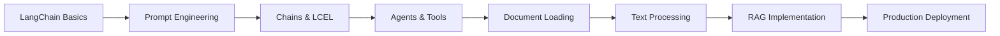
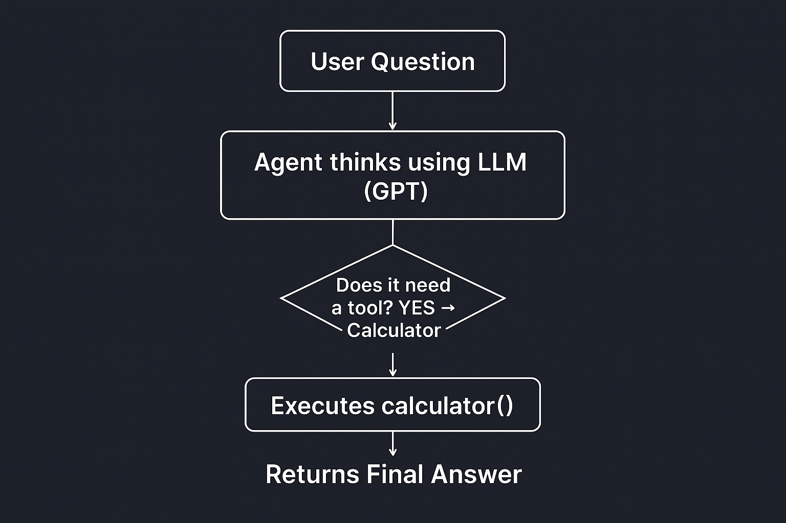

<div align="center">

# 🦜🔗 LangChain RAG Mastery

### *Complete Guide to Building Production-Ready LLM Applications*

[](https://www.python.org/downloads/)
[](https://python.langchain.com/)
[](https://openai.com/)
[](https://huggingface.co/)
[](LICENSE)

*A comprehensive learning repository demonstrating LangChain fundamentals, intelligent agents, and advanced RAG (Retrieval Augmented Generation) implementations.*

[Getting Started](#-getting-started) •
[Features](#-features) •
[Project Structure](#-project-structure) •
[Documentation](#-documentation) •
[Examples](#-examples)

</div>

---

## 🌟 Overview

This repository contains a **production-ready learning path** for building intelligent applications using LangChain, featuring hands-on Jupyter notebooks covering everything from basic LLM interactions to advanced Retrieval Augmented Generation (RAG) systems.

### What You'll Master

✨ **LangChain Fundamentals** - Model integration, prompt engineering, and chain composition  
🤖 **Intelligent Agents** - ReAct agents, custom tools, and autonomous decision-making  
📚 **RAG Systems** - Document loading, text splitting, embeddings, and vector stores  
🔄 **Production Patterns** - LCEL, few-shot learning, and output parsing

---

## 🎯 Features

<table>
<tr>
<td width="50%">

### 🔧 Core Capabilities

- **Multi-Model Support**: OpenAI, HuggingFace, and more
- **Advanced Prompting**: Templates, few-shot learning, chat models
- **Smart Agents**: ReAct framework with custom tool integration
- **RAG Pipeline**: Complete document processing workflow
- **Vector Stores**: Efficient similarity search implementation

</td>
<td width="50%">

### 📊 Technical Stack

```python
🦜 LangChain & LangGraph
🤖 OpenAI GPT-4 / GPT-3.5
🤗 HuggingFace Transformers
📄 Document Loaders (PDF, HTML)
🔍 Vector Databases
⚡ LCEL (LangChain Expression Language)
```

</td>
</tr>
</table>

---

## 📁 Project Structure

```
langchain-rag/
│
├── 📚 01_LangChain & Chatbot Mechanics/
│   ├── 01_defining_and_prompting_models.ipynb    # OpenAI & HuggingFace integration
│   ├── 02_prompt_templates.ipynb                 # Template design & LCEL chains
│   └── 03_Few_shot_prompting.ipynb               # Advanced prompting techniques
│
├── 🤖 02_Chains and Agents/
│   ├── 02_agent.ipynb                            # ReAct agents with LLM-Math tools
│   └── 03_custom_tools_for_agents.ipynb          # Building custom agent tools
│
├── 🔍 03_Retrieval Augmented Generation (RAG)/
│   ├── 01_integrating_document_loader.ipynb      # PDF & document loading
│   ├── 02_text_splitter.ipynb                    # Chunking strategies
│   └── [Additional RAG components]
│
├── 🖼️ Resources/
│   ├── LangChain's core component.png
│   ├── The LangChain Ecosystem.png
│   └── langchain_workflow.png
│
└── README.md
```

---

## 🚀 Getting Started

### Prerequisites

```bash
Python 3.11+
Jupyter Notebook/Lab
OpenAI API Key (for GPT models)
```

### Installation

```bash
# Clone the repository
git clone https://github.com/AbdulRehman393/langchain-rag.git
cd langchain-rag

# Install dependencies
pip install langchain langchain-core langchain-community langchain-openai
pip install langgraph transformers pypdf
pip install jupyter notebook

# Set up environment variables
export OPENAI_API_KEY='your-api-key-here'
```

### Quick Start

```python
from langchain_openai import ChatOpenAI
from langchain_core.prompts import PromptTemplate

# Initialize the model
llm = ChatOpenAI(model="gpt-4o-mini", api_key="YOUR_API_KEY")

# Create a prompt template
template = PromptTemplate.from_template("Explain {concept} in simple terms")

# Build a chain using LCEL
chain = template | llm

# Execute
response = chain.invoke({"concept": "RAG systems"})
print(response.content)
```

---

## 📖 Documentation

### Module 1: LangChain & Chatbot Mechanics

<details>
<summary><b>📘 Click to expand</b></summary>

#### **01_defining_and_prompting_models.ipynb**
- Setting up OpenAI and HuggingFace models
- Understanding model parameters (`temperature`, `max_tokens`)
- Basic prompt engineering
- Response handling with `.invoke()` and `.content`

#### **02_prompt_templates.ipynb**
- Dynamic prompt templates with variables
- LCEL (LangChain Expression Language) pipe operator `|`
- Chat models vs. completion models
- Building multi-step chains

#### **03_Few_shot_prompting.ipynb**
- Creating example sets for in-context learning
- `FewShotPromptTemplate` implementation
- Converting DataFrames to prompt examples
- Enhancing model accuracy with demonstrations

</details>

### Module 2: Chains and Agents

<details>
<summary><b>🤖 Click to expand</b></summary>

#### **02_agent.ipynb**
- **ReAct Agents**: Reason + Act framework
- LangGraph integration with `create_react_agent`
- Pre-built tools (LLM-Math, Wikipedia, etc.)
- Message handling and response extraction

#### **03_custom_tools_for_agents.ipynb**
- Building custom tools with `@tool` decorator
- Tool parameter schemas using Pydantic
- Connecting tools to agents
- Error handling and validation

</details>

### Module 3: Retrieval Augmented Generation (RAG)

<details>
<summary><b>🔍 Click to expand</b></summary>

#### **01_integrating_document_loader.ipynb**
- PDF loading with `PyPDFLoader`
- HTML parsing with `UnstructuredHTMLLoader`
- Document metadata extraction
- Multi-format document support

#### **02_text_splitter.ipynb**
- **CharacterTextSplitter**: Simple separator-based splitting
- **RecursiveCharacterTextSplitter**: Intelligent hierarchical splitting
- Chunk size and overlap configuration
- Preserving document context

#### **Advanced RAG Components** *(Coming Soon)*
- Embeddings generation (OpenAI, HuggingFace)
- Vector store integration (Chroma, FAISS, Pinecone)
- Similarity search and retrieval
- Complete RAG pipeline implementation

</details>

---

## 💡 Examples

### Example 1: Building a Math-Solving Agent

```python
from langgraph.prebuilt import create_react_agent
from langchain_community.agent_toolkits.load_tools import load_tools
from langchain_openai import ChatOpenAI

# Initialize model and tools
llm = ChatOpenAI(model="gpt-4o-mini", api_key=OPENAI_API_KEY)
tools = load_tools(["llm-math"], llm=llm)

# Create agent
agent = create_react_agent(llm, tools)

# Execute
result = agent.invoke({
    "messages": [("human", "What is the square root of 101?")]
})

print(result['messages'][-1].content)
# Output: The square root of 101 is approximately 10.05
```

### Example 2: RAG Document Processing

```python
from langchain_community.document_loaders import PyPDFLoader
from langchain.text_splitter import RecursiveCharacterTextSplitter

# Load document
loader = PyPDFLoader("document.pdf")
documents = loader.load()

# Split into chunks
splitter = RecursiveCharacterTextSplitter(
    chunk_size=1000,
    chunk_overlap=200,
    separators=["\n\n", "\n", " ", ""]
)

chunks = splitter.split_documents(documents)
print(f"Created {len(chunks)} chunks from the document")
```

---

## 🎓 Learning Path



**Recommended Study Order:**
1. ✅ Master LLM integration (Module 1)
2. ✅ Learn prompt templates and chains
3. ✅ Build intelligent agents (Module 2)
4. ✅ Implement RAG pipelines (Module 3)
5. 🚀 Deploy production systems

---

## 🛠️ Technologies & Frameworks

| Category | Tools |
|----------|-------|
| **LLM Framework** | LangChain, LangGraph, LangSmith |
| **Models** | OpenAI GPT-4/3.5, Meta Llama 3.3, HuggingFace Models |
| **Document Processing** | PyPDF, Unstructured, HTML Loaders |
| **Text Splitting** | CharacterTextSplitter, RecursiveCharacterTextSplitter |
| **Vector Stores** | Chroma, FAISS, Pinecone (Coming Soon) |
| **Development** | Jupyter Notebook, Python 3.11+ |

---

## 🏗️ Architecture Diagrams

<div align="center">

### LangChain Core Components


### LangChain Ecosystem


### Workflow Architecture


</div>

---

## 🤝 Contributing

Contributions are welcome! Here's how you can help:

1. 🍴 Fork the repository
2. 🌿 Create a feature branch (`git checkout -b feature/AmazingFeature`)
3. 💾 Commit your changes (`git commit -m 'Add some AmazingFeature'`)
4. 📤 Push to the branch (`git push origin feature/AmazingFeature`)
5. 🔃 Open a Pull Request

**Areas for Contribution:**
- Additional RAG examples
- Vector store implementations
- Multi-modal RAG systems
- Production deployment guides
- Performance optimization techniques

---

## 📚 Resources

### Official Documentation
- 📖 [LangChain Documentation](https://python.langchain.com/)
- 🦜 [LangChain Expression Language (LCEL)](https://python.langchain.com/docs/expression_language/)
- 🤖 [LangGraph Documentation](https://langchain-ai.github.io/langgraph/)
- 🔗 [OpenAI API Reference](https://platform.openai.com/docs/)

### Recommended Reading
- [Retrieval Augmented Generation Paper](https://arxiv.org/abs/2005.11401)
- [ReAct: Synergizing Reasoning and Acting in LLMs](https://arxiv.org/abs/2210.03629)
- [LangChain Cookbook](https://github.com/langchain-ai/langchain/tree/master/cookbook)

---

## 📝 License

This project is licensed under the MIT License - see the [LICENSE](LICENSE) file for details.

---

## 👨‍💻 Author

**Abdul Rehman**

[](https://github.com/AbdulRehman393)
[](https://linkedin.com/in/your-profile)

---

## ⭐ Support

If you found this repository helpful:

- ⭐ Star this repository
- 🐛 Report bugs via [Issues](https://github.com/AbdulRehman393/langchain-rag/issues)
- 💡 Share your implementations
- 🔔 Watch for updates

---

<div align="center">

### 🚀 Ready to build production-ready LLM applications?

**[Explore the Notebooks](./01_LangChain%20%26%20Chatbot%20Mechanics)** | **[View Examples](#-examples)** | **[Contribute](#-contributing)**

---

*Built with ❤️ using LangChain, OpenAI, and Python*

**Last Updated:** February 2026

</div>
